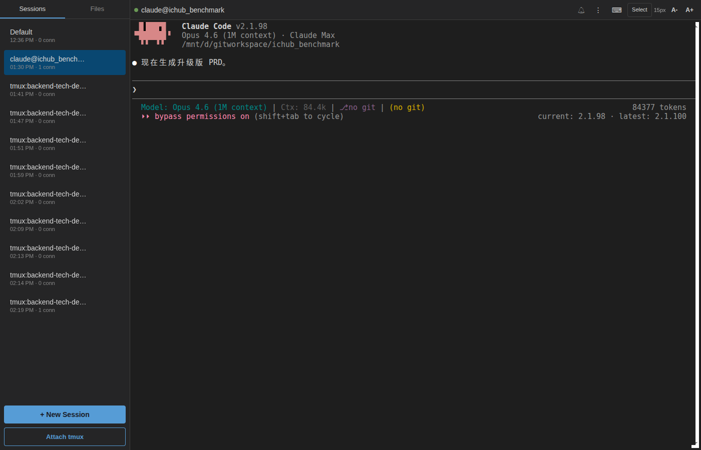
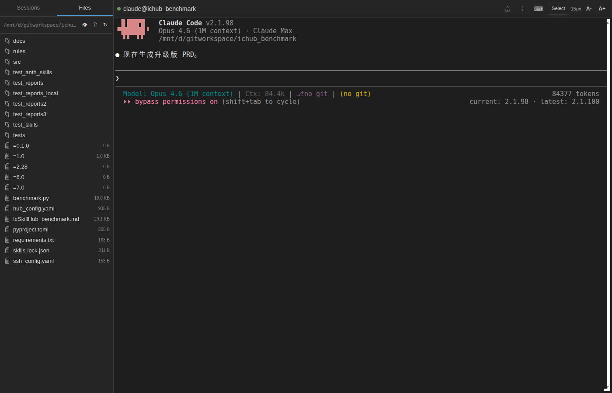
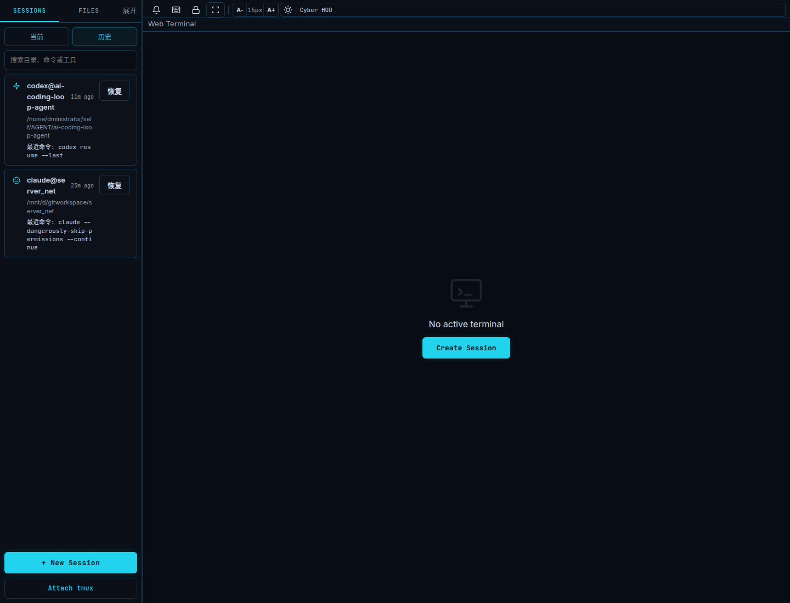
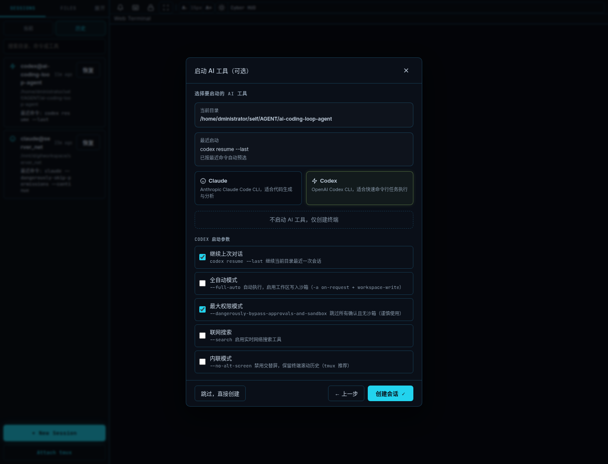
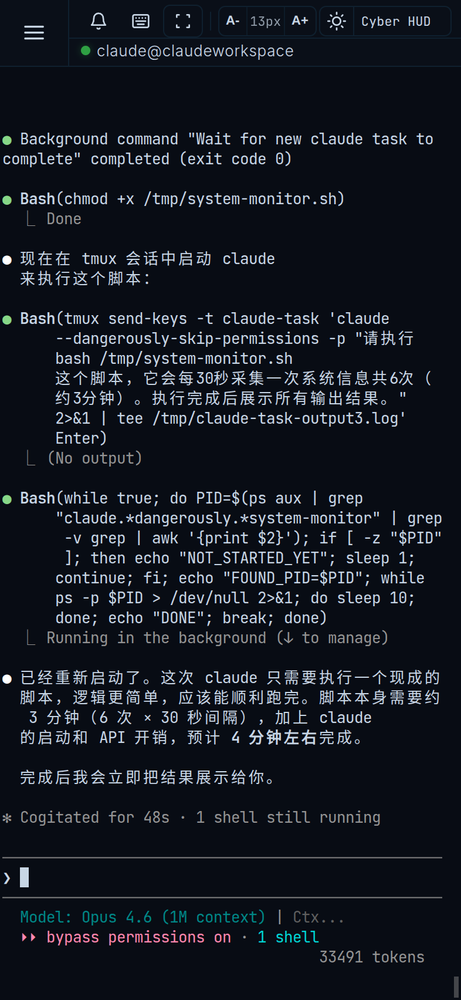
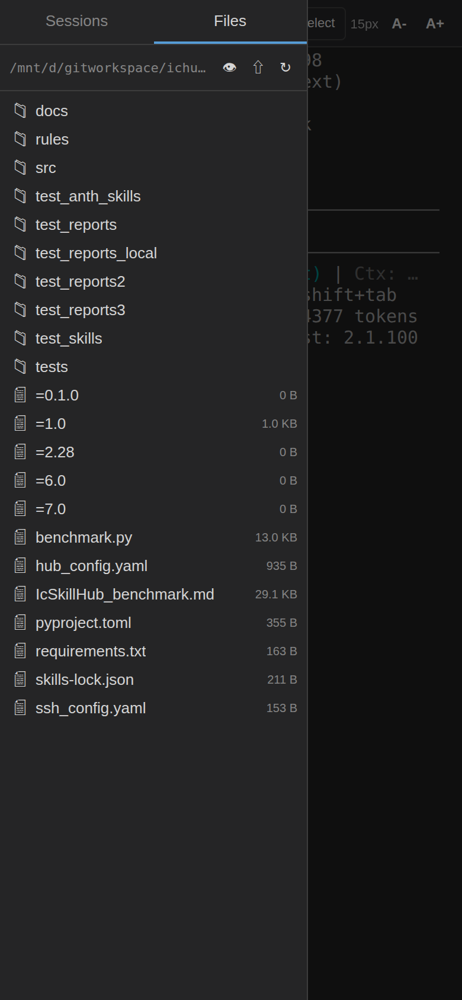
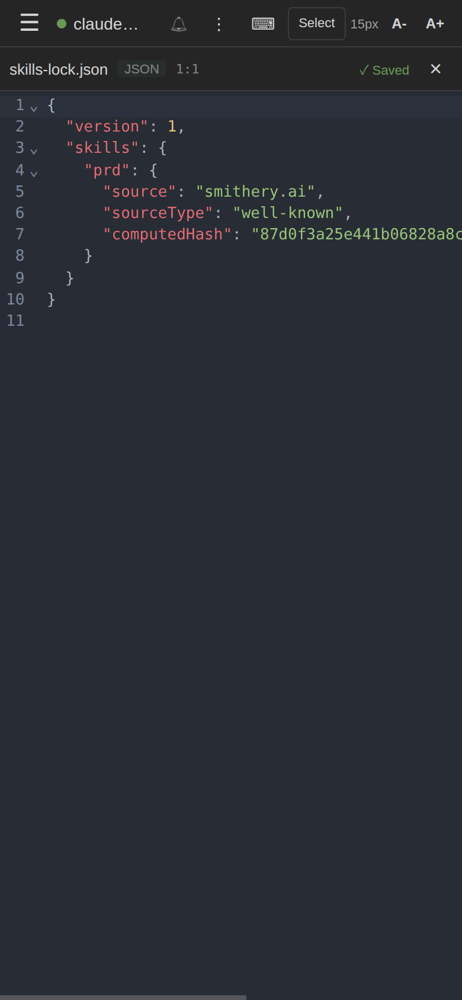

# Web Terminal

基于浏览器的终端管理工具，支持多会话、tmux 接入、AI 快捷键分析，针对手机端优化。

## 截图预览

### Web 端

| 主界面（Claude 会话） | 文件浏览器 | 代码编辑器 |
|:---:|:---:|:---:|
|  |  |  |

| 通知面板 | 历史会话恢复 | 最近目录自动预选 | tmux 会话管理 |
|:---:|:---:|:---:|:---:|
|  |  |  |  |

### 手机端

| 终端界面 | 会话列表 | 文件浏览器 | 代码编辑器 |
|:---:|:---:|:---:|:---:|
|  |  |  |  |

| 通知呼吸灯 | 手机端快捷键栏 | 目录选择 | AI 工具选择 |
|:---:|:---:|:---:|:---:|
|  |  |  |  |

## 功能特性

- **多会话管理**：侧边栏切换，支持任意数量并发终端会话
- **历史会话恢复**：Sessions 面板内置历史视图，按目录去重缓存非 tmux 会话，支持搜索并一键按最近命令恢复
- **tmux 接入**：将已有 tmux 会话挂载为浏览器标签
- **新建会话向导**：图形化选择工作目录、AI 工具（Claude / Codex / 无）
  - 最近目录确认后可直接进入 AI 工具步骤
  - 自动显示并预选该目录最近一次 Claude / Codex 启动命令
- **固定快捷键栏**：根据会话类型自动显示对应按钮
  - 普通终端：方向键、ESC 等通用按钮
  - Claude 会话：/clear、/compact、接受/拒绝等
  - Codex 会话：接受/拒绝、全自动模式等
  - tmux 会话：滚动、PgUp、新窗口、改名等
- **AI 快捷键分析**（可选）：调用 OpenRouter API 分析终端内容，推荐下一步快捷键
- **AI 通知铃铛**：Claude / Codex 会话等待确认、空闲、出错时自动弹通知
  - Toolbar 铃铛图标 + 未读角标 + 摇动动画
  - 侧边栏会话呼吸灯 + 铃铛闪动，一眼定位需要操作的会话
  - 点击通知自动跳转对应会话
  - 支持浏览器原生通知（页面后台时弹窗提醒）
  - 可选通知声音（支持开关）
  - Claude / Codex 项目级 hooks 做增量注入与精确清理，不覆盖用户原有 hook 配置
- **文件浏览器**：侧边栏 Files tab 查看当前会话工作目录
  - 懒加载文件树，点击文件夹展开
  - 隐藏文件切换（默认隐藏 node_modules、.git 等）
  - 右键菜单：新建、重命名、删除、下载
  - 拖拽上传文件，文件夹 zip 下载
- **代码编辑器**：点击文件在浏览器内编辑
  - CodeMirror 6 引擎，支持 JS/TS/Python/JSON/YAML/Markdown/HTML/CSS/SQL 等语法高亮
  - 自动保存（1 秒防抖）+ Ctrl+S 手动保存
  - 保存状态实时显示（Saved / Saving / Unsaved）
- **配色主题**：内置 9 套主题（VS Code Dark、Tokyo Night、Dracula、Gruvbox、Nord、One Dark、Catppuccin、Solarized、Monokai）
- **手机端优化**：惯性滚动、输入法自适应、防误触

## 系统要求

- Node.js >= 18
- Linux / macOS（依赖 node-pty，需要本地编译环境）
- 如需 tmux 接入功能，需安装 tmux

### 编译依赖（node-pty 原生模块）

**Debian / Ubuntu：**
```bash
sudo apt install build-essential python3
```

**CentOS / RHEL：**
```bash
sudo yum groupinstall "Development Tools" && sudo yum install python3
```

**macOS：**
```bash
xcode-select --install
```

## 安装

```bash
cd web-terminal
npm install
```

## 配置

所有配置通过环境变量设置，无需修改代码。

| 环境变量 | 默认值 | 说明 |
|---|---|---|
| `PORT` | `3456` | 服务监听端口 |
| `WEB_TERMINAL_DATA_DIR` | `./.web-terminal` | 数据目录，保存密码、最近目录、hook 配置等 |
| `OPENROUTER_API_KEY` | 无 | OpenRouter API Key，**不设置则 AI 功能自动关闭** |

## 启动

推荐使用 `systemd` 运行，适合这个项目依赖宿主机真实路径、tmux、Claude/Codex hooks 的场景。

> **部署说明**
> 这个项目本质上是宿主机终端管理器，历史路径恢复、tmux 接入、Claude/Codex hooks 注入都依赖宿主机真实环境。
> 因此**不推荐使用 `docker-compose` 作为正式部署方式**，否则容易出现路径恢复失败、tmux 不可见、hook 写入位置不一致等问题。

### 1. 准备环境变量

可直接导出环境变量，或写入当前目录 `.env`：

```bash
export PORT=3456
export WEB_TERMINAL_DATA_DIR=/home/dministrator/claudeworkspace/web-terminal/.web-terminal
# 可选：启用 AI 快捷键分析
export OPENROUTER_API_KEY=sk-or-xxxxxx
```

- `WEB_TERMINAL_DATA_DIR`：服务数据目录，默认就是项目里的 `./.web-terminal`

### 2. 直接启动

```bash
node server.js
```

访问地址：

```text
http://localhost:3456
```

### 3. 开机自启动

项目已提供 `systemd` 单元文件：

[systemd/web-terminal.service](/home/dministrator/claudeworkspace/web-terminal/systemd/web-terminal.service)

如果有 `sudo`，推荐安装成系统服务：

```bash
sudo cp systemd/web-terminal.service /etc/systemd/system/web-terminal.service
sudo systemctl daemon-reload
sudo systemctl enable --now web-terminal
```

如果当前机器不方便使用 `sudo`，也可以放到用户级目录：

```bash
mkdir -p ~/.config/systemd/user/default.target.wants
cp systemd/web-terminal.service ~/.config/systemd/user/web-terminal.service
ln -sf ~/.config/systemd/user/web-terminal.service ~/.config/systemd/user/default.target.wants/web-terminal.service
```

说明：

- 系统级 `systemd` 方案最稳，推荐优先使用
- 用户级 `systemd` 方案适合没有 `sudo` 的场景，但是否能立即 `enable --now` 取决于当前机器的 user bus / session 配置
- 当前项目提供的启动脚本为 [scripts/start-web-terminal.sh](/home/dministrator/claudeworkspace/web-terminal/scripts/start-web-terminal.sh)

### 4. 常用命令

```bash
# 查看日志
journalctl -u web-terminal -f

# 查看文件日志
tail -f .web-terminal/logs/service.log

# 重启服务
sudo systemctl restart web-terminal

# 停止服务
sudo systemctl stop web-terminal

# 查看状态
sudo systemctl status web-terminal
```

## AI 功能说明

AI 快捷键分析功能依赖 [OpenRouter](https://openrouter.ai/) 服务，使用 `mistralai/ministral-3b` 模型（费用极低）。

- **不设置** `OPENROUTER_API_KEY`：AI 按钮不显示，其余功能完全正常
- **设置后**：点击快捷键栏右侧的 ⟳ 按钮触发分析，不会自动消耗 API 调用

获取 API Key：访问 https://openrouter.ai/keys

## 使用说明

### 基本操作

- **新建会话**：点击侧边栏底部 `+ New Session`，按向导选择目录和工具
- **切换会话**：点击侧边栏中的会话名称
- **关闭会话**：长按会话名称 → 删除，或点击会话旁的 × 按钮
- **恢复历史会话**：在 `Sessions` 面板切到 `历史`，搜索目录后点击 `恢复`
- **接入 tmux**：点击侧边栏底部 `Attach tmux`

### 快捷键栏

点击工具栏右侧 `⌨` 图标展开/收起快捷键栏。

- 第一行：根据会话类型显示固定按钮（包含配色 🎨 和清空输入框按钮）
- 第二行（仅配置了 API Key 时显示）：AI 分析推荐的快捷键

### 配色主题

点击快捷键栏中的 🎨 按钮，从 8 套主题中选择，选择后自动保存。

### 通知铃铛

当 Claude / Codex 会话需要你操作时（等待确认、空闲、出错、会话结束），工具栏铃铛会自动摇动并显示未读数。

- 点击铃铛查看通知列表，点击某条通知跳转到对应会话
- 侧边栏中有未读通知的会话会显示红色呼吸灯 + 摇动铃铛图标
- 页面在后台时会弹浏览器系统通知
- 通知面板内可开关提示音

### Codex / Claude 项目级 Hooks

Web Terminal 会按项目注入 Claude / Codex 的 hooks，用于通知回传和项目级事件开关：

- 已有项目级 hook 时只做增量合并，不覆盖用户原有内容
- 会话退出且项目不再被任何活动会话使用时，只清理 Web Terminal 自己注入的 hook
- 如果项目根下 `.codex` 原本是文件，服务会自动备份后迁移成目录，再写入官方约定的 `.codex/hooks.json`

### 手机端使用

- 左滑/右滑侧边栏来切换
- 快捷键栏可水平滑动
- 输入法弹出时，快捷键栏会自动贴近键盘上方
- 进入 Select 模式后可用手指长按选择文字

## 目录结构

```
web-terminal/
├── server.js          # 后端服务（Express + WebSocket + node-pty）
├── package.json
└── public/
    ├── index.html     # 页面入口
    ├── app.js         # 前端逻辑
    └── style.css      # 样式
```
