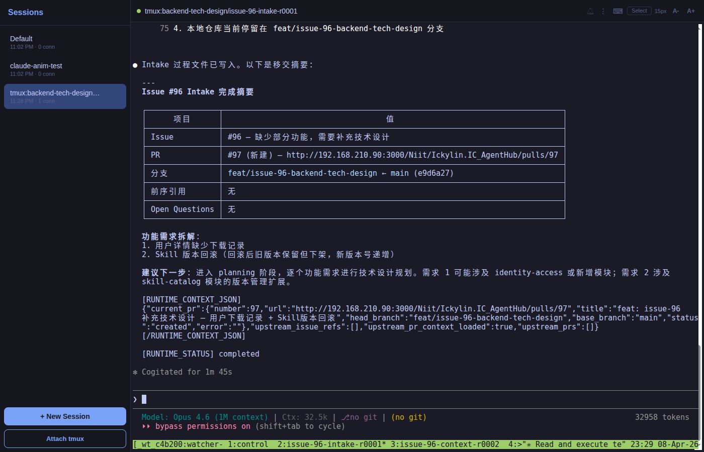
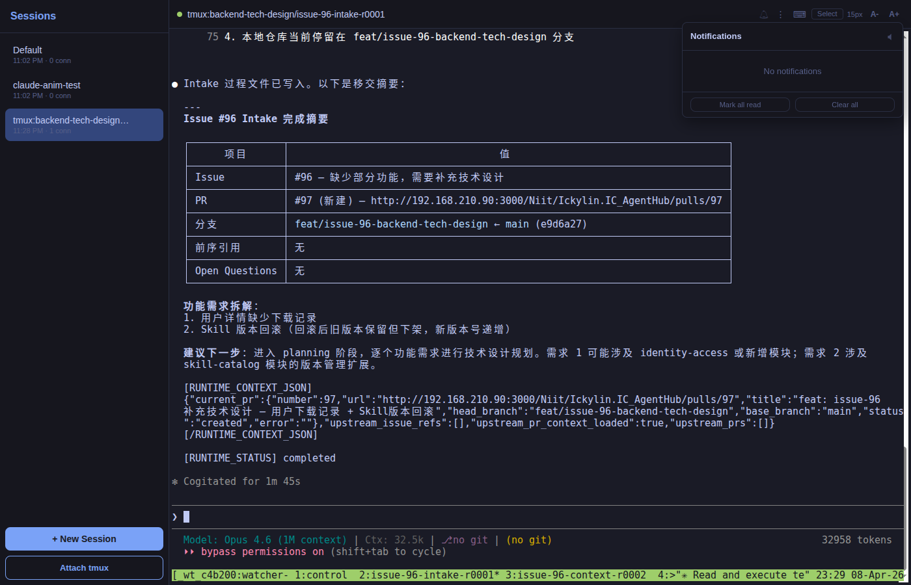
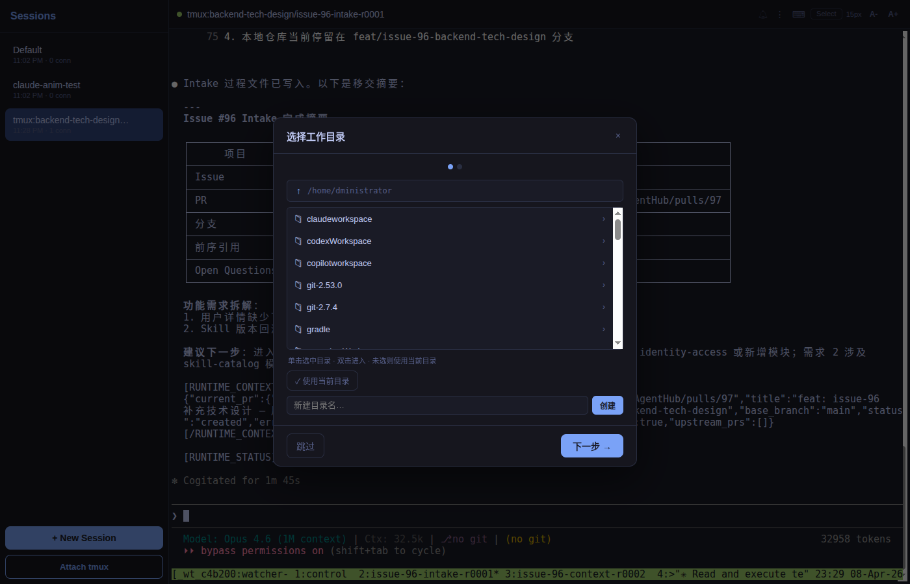
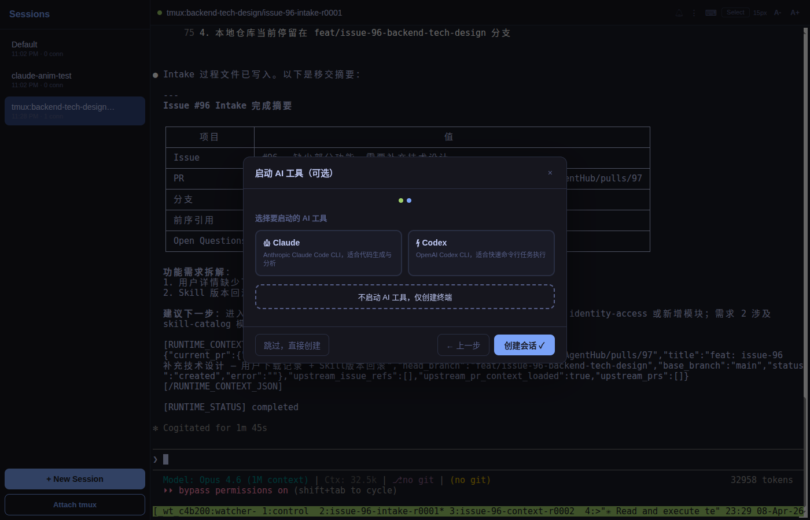
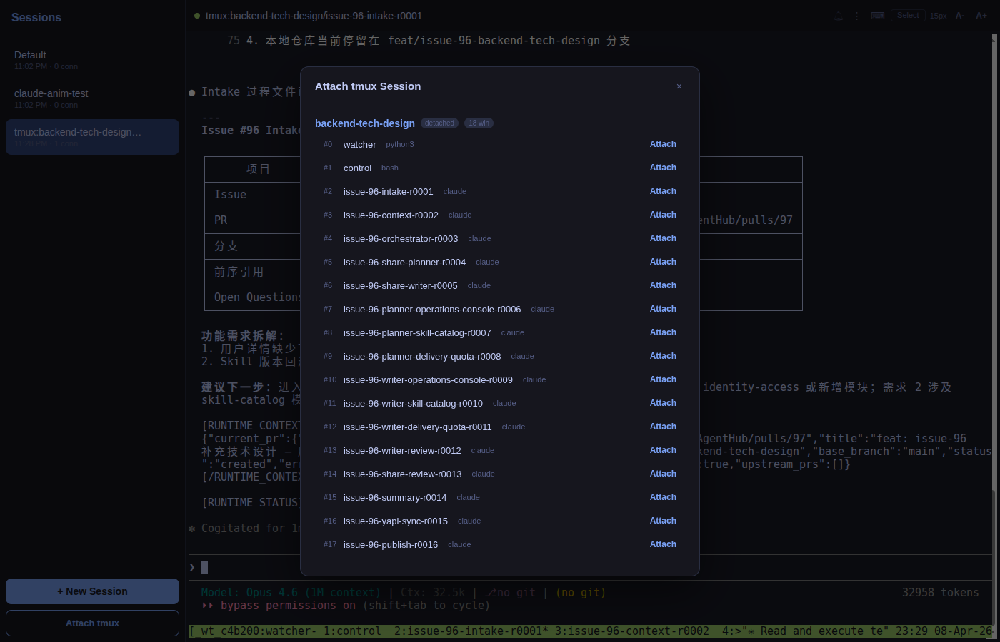
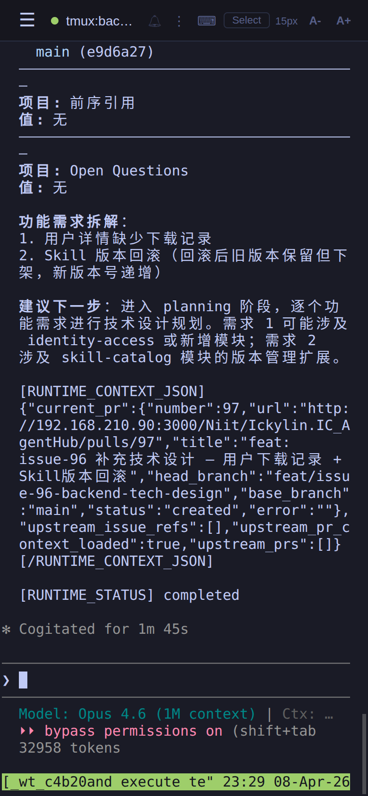
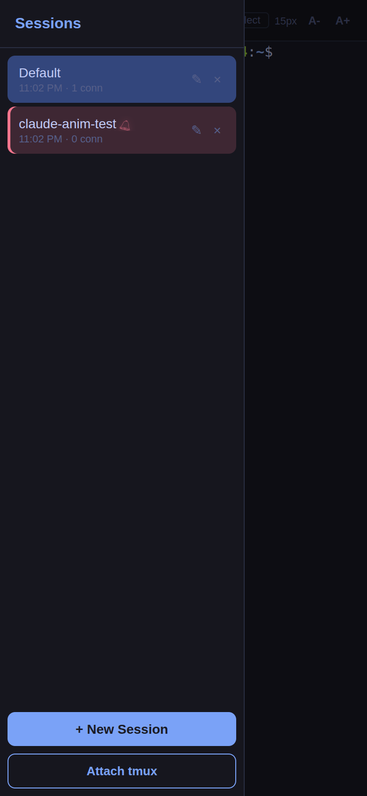
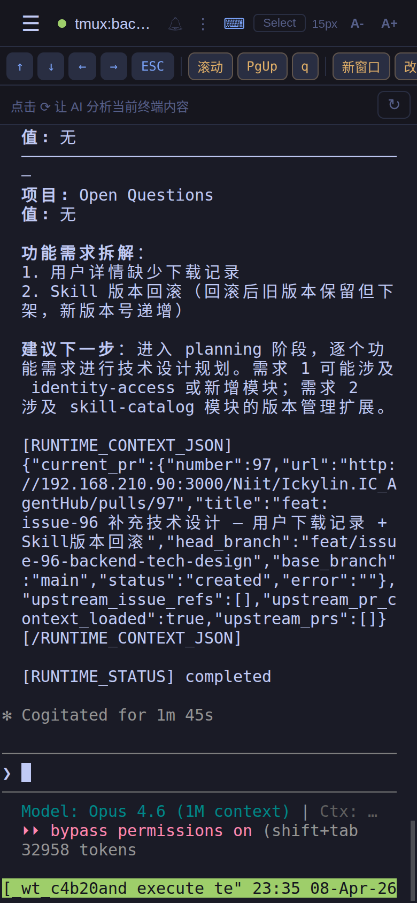
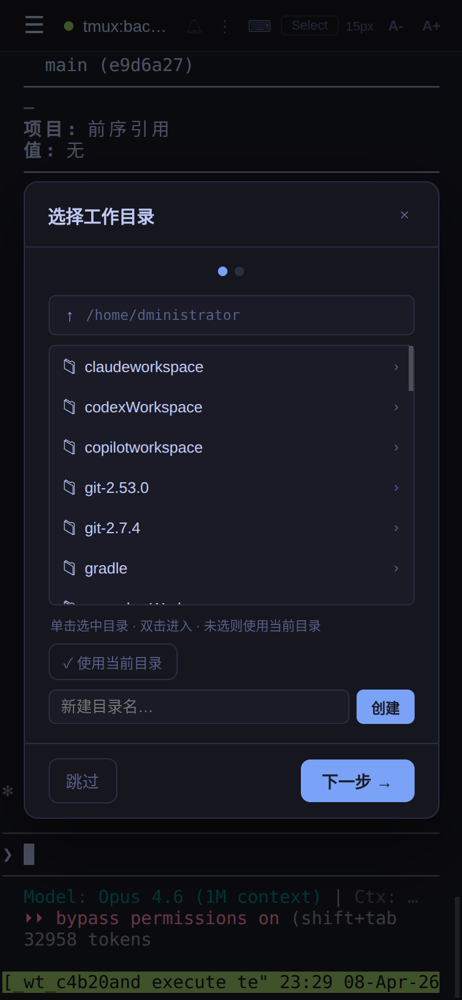
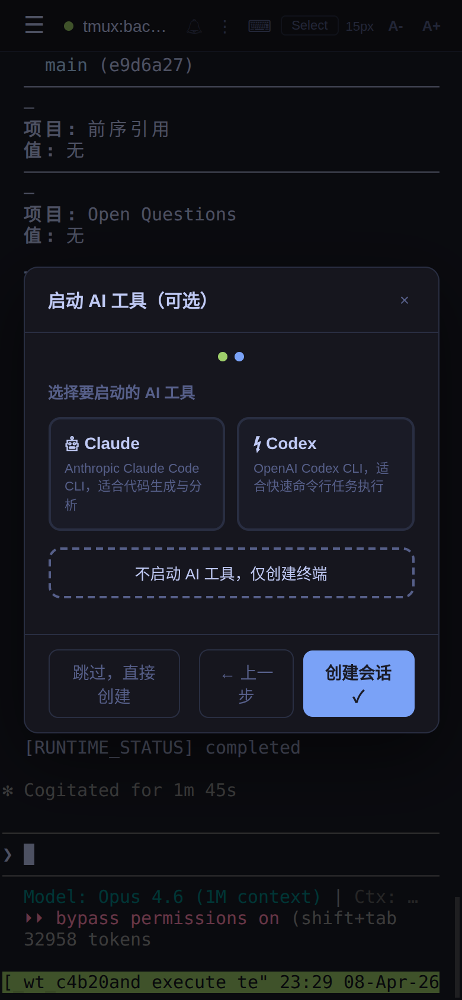

# Web Terminal

基于浏览器的终端管理工具，支持多会话、tmux 接入、AI 快捷键分析，针对手机端优化。

## 截图预览

### Web 端

| 主界面 | 通知面板 |
|:---:|:---:|
|  |  |

| 新建会话 — 目录选择 | 新建会话 — AI 工具选择 | tmux 会话管理 |
|:---:|:---:|:---:|
|  |  |  |

### 手机端

| 终端界面 | 侧边栏 + 通知呼吸灯 | 手机端快捷键栏 | 目录选择 | AI 工具选择 |
|:---:|:---:|:---:|:---:|:---:|
|  |  |  |  |  |

## 功能特性

- **多会话管理**：侧边栏切换，支持任意数量并发终端会话
- **tmux 接入**：将已有 tmux 会话挂载为浏览器标签
- **新建会话向导**：图形化选择工作目录、AI 工具（Claude / Codex / 无）
- **固定快捷键栏**：根据会话类型自动显示对应按钮
  - 普通终端：方向键、ESC 等通用按钮
  - Claude 会话：/clear、/compact、接受/拒绝等
  - Codex 会话：接受/拒绝、全自动模式等
  - tmux 会话：滚动、PgUp、新窗口、改名等
- **AI 快捷键分析**（可选）：调用 OpenRouter API 分析终端内容，推荐下一步快捷键
- **AI 通知铃铛**：Claude / Codex 会话等待确认、空闲、出错时自动弹通知
  - Toolbar 铃铛图标 + 未读角标 + 摇动动画
  - 侧边栏会话呼吸灯 + 铃铛闪动，一眼定位需要操作的会话
  - 点击通知自动跳转对应会话
  - 支持浏览器原生通知（页面后台时弹窗提醒）
  - 可选通知声音（支持开关）
- **配色主题**：内置 8 套程序员主题（Tokyo Night、Dracula、Gruvbox、Nord、One Dark、Catppuccin、Solarized、Monokai）
- **手机端优化**：惯性滚动、输入法自适应、防误触

## 系统要求

- Node.js >= 18
- Linux / macOS（依赖 node-pty，需要本地编译环境）
- 如需 tmux 接入功能，需安装 tmux

### 编译依赖（node-pty 原生模块）

**Debian / Ubuntu：**
```bash
sudo apt install build-essential python3
```

**CentOS / RHEL：**
```bash
sudo yum groupinstall "Development Tools" && sudo yum install python3
```

**macOS：**
```bash
xcode-select --install
```

## 安装（全新）

```bash
tar xzf web-terminal.tar.gz
cd web-terminal
npm install
```

## 升级（已有旧版本）

```bash
# 1. 停止旧服务
kill $(lsof -t -i :3456)

# 2. 备份旧目录（可选）
mv web-terminal web-terminal.bak

# 3. 解压新包
tar xzf web-terminal.tar.gz
cd web-terminal

# 4. 重新安装依赖（依赖没变可跳过，但建议执行以确保一致）
npm install

# 5. 重新启动
node server.js
```

> **注意**：配置项（环境变量）保持不变，无需额外迁移。

## 配置

所有配置通过环境变量设置，无需修改代码。

| 环境变量 | 默认值 | 说明 |
|---|---|---|
| `PORT` | `3456` | 监听端口 |
| `OPENROUTER_API_KEY` | 无 | OpenRouter API Key，**不设置则 AI 功能自动关闭** |

## 启动

```bash
# 直接启动
node server.js

# 或使用 npm
npm start

# 指定端口
PORT=8080 node server.js

# 启用 AI 快捷键分析
OPENROUTER_API_KEY=sk-or-xxxxxx node server.js
```

启动后访问：`http://localhost:3456`（或指定的端口）

### 后台运行（推荐）

```bash
# 使用 nohup
nohup OPENROUTER_API_KEY=sk-or-xxxxxx node server.js > web-terminal.log 2>&1 &

# 或使用 tmux
tmux new-session -d -s web-terminal 'node server.js'

# 或使用 pm2
npm install -g pm2
pm2 start server.js --name web-terminal
pm2 save
```

## AI 功能说明

AI 快捷键分析功能依赖 [OpenRouter](https://openrouter.ai/) 服务，使用 `mistralai/ministral-3b` 模型（费用极低）。

- **不设置** `OPENROUTER_API_KEY`：AI 按钮不显示，其余功能完全正常
- **设置后**：点击快捷键栏右侧的 ⟳ 按钮触发分析，不会自动消耗 API 调用

获取 API Key：访问 https://openrouter.ai/keys

## 使用说明

### 基本操作

- **新建会话**：点击侧边栏底部 `+ New Session`，按向导选择目录和工具
- **切换会话**：点击侧边栏中的会话名称
- **关闭会话**：长按会话名称 → 删除，或点击会话旁的 × 按钮
- **接入 tmux**：点击侧边栏底部 `Attach tmux`

### 快捷键栏

点击工具栏右侧 `⌨` 图标展开/收起快捷键栏。

- 第一行：根据会话类型显示固定按钮（包含配色 🎨 和清空输入框按钮）
- 第二行（仅配置了 API Key 时显示）：AI 分析推荐的快捷键

### 配色主题

点击快捷键栏中的 🎨 按钮，从 8 套主题中选择，选择后自动保存。

### 通知铃铛

当 Claude / Codex 会话需要你操作时（等待确认、空闲、出错、会话结束），工具栏铃铛会自动摇动并显示未读数。

- 点击铃铛查看通知列表，点击某条通知跳转到对应会话
- 侧边栏中有未读通知的会话会显示红色呼吸灯 + 摇动铃铛图标
- 页面在后台时会弹浏览器系统通知
- 通知面板内可开关提示音

### 手机端使用

- 左滑/右滑侧边栏来切换
- 快捷键栏可水平滑动
- 输入法弹出时，快捷键栏会自动贴近键盘上方
- 进入 Select 模式后可用手指长按选择文字

## 目录结构

```
web-terminal/
├── server.js          # 后端服务（Express + WebSocket + node-pty）
├── package.json
└── public/
    ├── index.html     # 页面入口
    ├── app.js         # 前端逻辑
    └── style.css      # 样式
```
